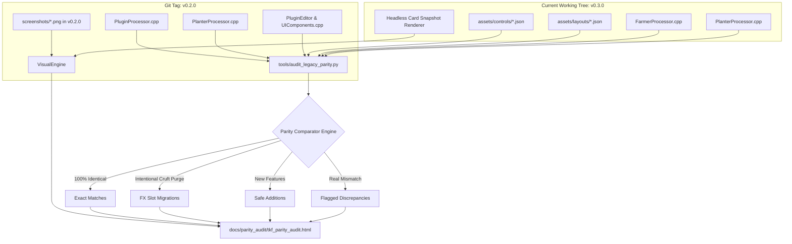

# Implementation Plan: Automated v0.2.0 Legacy Parity Audit

## Goal Description
To ensure the transition to the new JSON-driven architecture is 100% transparent to end-users and completely preserves backward compatibility for existing presets and DAW sessions, we need a comprehensive, automated audit comparing legacy `v0.2.0` C++ parameter definitions, string formatters, tooltips, and UI colors against the current `v0.3.0` data-driven JSON architecture.

The audit covers both **The Klang Farmer (TKF)** and **The Klang Planter (TKP)**, outputting an executive dashboard and a print-ready HTML/PDF report with side-by-side card screenshots.

---

## Codebase Context & Architectural Baselines

### 1. Dual Plugin Scope
| Target | Legacy `v0.2.0` Source | Current `v0.3.0` Source & Assets |
| :--- | :--- | :--- |
| **The Klang Farmer (TKF)** | `source/PluginProcessor.cpp` `source/PluginEditor.cpp` *(142 APVTS parameters hardcoded in C++)* | `source/FarmerProcessor.cpp` `source/FarmerEditor.cpp` `assets/controls/carrier.json` `assets/controls/envelopes.json` `assets/controls/filters.json` `assets/controls/fx.json` `assets/controls/global.json` `assets/controls/mixer.json` `assets/controls/modulators.json` `assets/layouts/tkf_layout.json` *(106 APVTS parameters)* |
| **The Klang Planter (TKP)** | `source/PlanterProcessor.cpp` `source/PlanterEditor.cpp` *(32 APVTS parameters hardcoded in C++)* | `source/PlanterProcessor.cpp` `source/PlanterEditor.cpp` `assets/controls/planter.json` `assets/layouts/tkp_layout.json` *(36 APVTS parameters)* |

### 2. Cruft Purge & FX Slot Migration Handling (Rule #1)
In `v0.2.0`, TKF contained 9 standalone, hardcoded FX blocks with 36 APVTS parameters:
- `drive_amount`, `drive_bias`, `drive_limiter`
- `pre_limiter_thresh`, `pre_limiter_release`, `pre_limiter_gain`, `pre_limiter_enable`
- `post_limiter_thresh`, `post_limiter_release`, `post_limiter_gain`, `post_limiter_enable`
- `fxfilter_cutoff`, `fxfilter_resonance`, `fxfilter_type`, `fxfilter_slope`
- `wavefolder_fold`, `wavefolder_bias`, `wavefolder_type`, `wavefolder_filter`
- `ringmod_shape`, `ringmod_rate`, `ringmod_amount`, `ringmod_width`
- `freqshift_shift`, `freqshift_blend`, `freqshift_width`, `freqshift_range`
- `grit_bits`, `grit_rate`, `grit_low`, `grit_high`
- `comb_dampening`, `comb_cutoff`, `comb_resonance`, `comb_mix`
- `phasesmear_cutoff`, `phasesmear_resonance`, `phasesmear_type`, `phasesmear_amount`
- `eq_freq`, `eq_width`, `eq_gain`, `eq_filter`

As completed in Milestone v0.3.0 Item 4 (Cruft Purge, commit `4001296`), these static blocks were intentionally purged from the static engine and migrated into the dynamic 8-slot Multi-Instance FX engine (`pre_fx_1..4` and `post_fx_1..4`) using catalog algorithms 1..13 in `fx.json`.  
**Auditor Rule:** The audit script must classify these 36 parameters as **"Intentionally Migrated to Dynamic Multi-Instance FX Slots"** rather than flagging them as missing regressions.

### 3. Safe Additions & Backward Compatibility (Rule #2)
New features added in `v0.3.0` that expand capabilities without modifying existing parameter indices (e.g., appended tracking options, TKP Limiter, TKP Pre-Filter Crossfader & Drive) must be classified as **"Safe Additions (New in v0.3.0)"**.

---

## Audit Strategy & Architecture

---

## Detailed Execution Phases

### Phase 1: Python Extraction Engine (`tools/audit_legacy_parity.py`)
Build an automated extraction script in `tools/audit_legacy_parity.py`:
1. **Extract Legacy Data (via `git show v0.2.0:source/...`)**:
   - Parse `v0.2.0:source/PluginProcessor.cpp` and `source/PlanterProcessor.cpp` for all `layout.add()` parameter declarations:
     - `paramID`, `name`, `type` (`float`, `choice`)
     - `range` (min, max, step, skew)
     - `defaultValue`, `doubleClickValue`
     - `choices` string arrays
     - String formatters (`getTextFromValue` lambdas)
     - Tooltips / descriptive comments
   - Parse `v0.2.0:source/PluginEditor.cpp`, `PlanterEditor.cpp`, and `UIComponents.cpp` for card accent colors (`juce::Colour(0x...)`).
2. **Extract Current Data**:
   - Parse all current JSON files in `assets/controls/*.json` (`carrier.json`, `envelopes.json`, `filters.json`, `fx.json`, `global.json`, `mixer.json`, `modulators.json`, `planter.json`, `global_ui.json`).
   - Parse current `assets/layouts/tkf_layout.json` and `tkp_layout.json` for card grouping, knob assignment, and page structure.
   - Parse `source/FarmerProcessor.cpp` and `source/PlanterProcessor.cpp` for parameter registration confirmation.

### Phase 2: Parity Comparator & Categorization Engine
Implement a strict comparison engine classifying every parameter into one of 4 buckets:
1. **Exact Match (Green)**: ID, Name, Range (min/max/step/skew), Default, Double-Click, Type, and Formatting are identical within floating-point tolerance ($\epsilon < 1e-4$).
2. **Intentional FX Migration (Blue / Info)**: The 36 legacy standalone FX parameters verified as successfully replaced by dynamic slots in `fx.json`.
3. **Safe Addition (Yellow / Notice)**: New parameters introduced in v0.3.0 (e.g. `tkp_prefilter_xfade`, `tkp_limiter_thresh`, `modenv3_*`).
4. **Discrepancy (Red / Action Required)**: Any unexpected difference in min/max, skew curve, default value, choice order, or formatting that could alter existing patch sounds or DAW automation.

### Phase 3: Headless Visual Snapshot Pipeline
1. **Legacy Baselines**:
   - Extract the committed `v0.2.0` visual baselines from git (`git show v0.2.0:screenshots/...`) into a temporary staging folder (`docs/parity_audit/legacy_snapshots/`).
2. **Current Snapshots**:
   - Utilize JUCE's offscreen component snapshotting (as implemented in `gui_tests` / `test/capture_screenshot.cpp`) to capture fresh, pixel-perfect PNG renders of every card across The Klang Farmer (Pages 0–6) and The Klang Planter.
   - Crop or render each Card individually (`Carrier`, `Modulator`, `Pitch Env`, `Transients`, `Filters`, `Amplifier`, `Mod Envelopes`, `Mixer`, `FX Slots`).

### Phase 4: Print-Ready HTML & PDF Report Generator
Generate a self-contained, beautifully styled HTML document: `docs/parity_audit/tkf_parity_audit.html`.
- **User Design Directives Honored**:
  - *"1 card and 4 parameters per page, fill up the page, no tiny bullshit text"*.
  - Large typography (20–24px body text, 32px headers).
  - Side-by-side card screenshots at the top of each card section (Legacy v0.2.0 Left vs Current v0.3.0 Right).
  - Color-coded comparison table showing:
    - **Type** (Float vs Choice)
    - **Rendered Range** (e.g., `20.0 Hz to 24.0 kHz`)
    - **Default & Double-Click Values**
    - **Rendered Formatter Output** (e.g., `50%`, `+3.0 dB`, `120 ms`)
    - **Accent Color** (Hex code swatch)
    - **Tooltip / Description**
  - Discrepancies highlighted in high-contrast red callouts (`<mark>`).
  - `@media print { .card-page { page-break-after: always; height: 100vh; } }` so printing or saving as PDF in Chrome/Edge produces a clean, slide-deck style report.

### Phase 5: Verification & Remediation Loop
1. Execute `python tools/audit_legacy_parity.py`.
2. Inspect the resulting HTML report.
3. If any unintentional discrepancies are discovered:
   - Fix the JSON definitions in `assets/controls/`.
   - Re-run `build-validate` (`dsp_tests` & `gui_tests`) to guarantee 100% test parity.
   - Re-run the parity script until zero unintentional red discrepancies remain.

---

## Definition of Done
- `tools/audit_legacy_parity.py` runs cleanly with zero runtime errors.
- `docs/parity_audit/tkf_parity_audit.html` is generated with complete coverage of all parameters in TKF and TKP.
- Every discrepancy is either resolved or verified as an intentional architectural upgrade.
- Both `dsp_tests` and `gui_tests` pass with zero failures.
