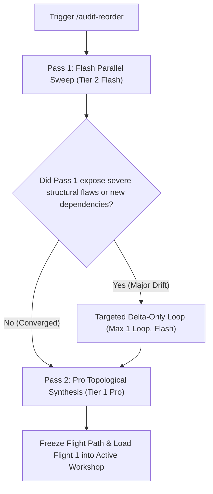

# 🛫 The Audit & Itinerary Re-Order Protocol (The 2-Pass Convergence Gate)

**Trigger:** `/audit-reorder`, `/reorder-audit`, `/reorder-itinerary`, `/rejigger`, `/re-sequence`, `/resequence`, "rejigger itinerary", "re-sequence flights", "audit and reorder", "reorder topics"

When the user requests an audit or re-ordering of in-flight research/sanity topics (or clicks `[ 🔄 Re-sequence Flights ]` / `[ 🔄 Rejigger Itinerary ]` in the sidecar), execute this skill to synthesize all active topics, eliminate redundancies, establish topological prerequisites, and compute cumulative token/allowance impact.

---

## Phase 1: Topic Inventory & State Sweep
1. **Sweep Active Topics**: Read the active sidecar canvas (`.agents/sidecar/nkai_deep_research.html`), `.agents/pipeline/plans/`, and `docs/BACKLOG.md`.
2. **Collect Current Verdicts**: Identify all items marked `APPROVED`, `TABLED`, `KILLED`, or `PENDING`.
3. **Capture Spontaneous Proposals**: Extract any newly proposed topics, user suggestions, or architectural forks mentioned in recent turns.

---

## Phase 2: The 2-Pass Convergence Gate (Anti-Echo & Quota Protection)

To avoid infinite multi-agent debate, token burning, and academic echo chambers, the re-ordering protocol enforces a strict **2-Pass Convergence Architecture**:

### Invariants of the 2-Pass Gate:
1. **Strict Hard Cap (Max 2 Passes)**: Under no circumstances may subagent reflection loops exceed 2 passes. Gains plateau steeply after iteration 2; further loops cause semantic drift and token waste.
2. **Model Gating (Flash Explores, Pro Synthesizes)**:
   - **Pass 1 (Flash High / Tier 2)**: Parallel `explore` and `contrarian` subagents sweep all active options, evaluating affirmative Pros [Thesis], negative Cons [Thesis Friction], and stress-testing Devil's Advocate [Antithesis] failure modes.
   - **Pass 2 (Pro High / Tier 1)**: Exactly ONE Pro subagent (`Audit & Itinerary Synthesis Architect`) ingests the findings, aggressively consolidates overlapping topics (e.g. 19 raw topics $\rightarrow$ 9 cohesive nodes), sequences them strictly prerequisite-first, and freezes the flight path.
3. **Delta-Only Chunking**: If a loop 2 is needed, subagents are NOT tasked with re-researching the entire corpus from scratch; they receive strictly the *delta* (the 2–3 contentious or newly proposed nodes).
4. **Hard Timeout**: 5-minute watchdog timer per subagent pass.

---

## Phase 3: Topological Dependency & Allowance Analysis

The Pro Architect applies strict systems engineering rules:
1. **Topological Ordering Invariant**:
   - *Bedrock Foundations* (Canonical State, Lock-free IPC, Wire Protocols) MUST precede...
   - *Routing & AI Harnesses* (Skill Taxonomy, Cross-Host Adapters) MUST precede...
   - *Surfaces & Viewports* (Header Ergonomics, Tab Density, Canvas Modes) MUST precede...
   - *Meta, Packaging & Distribution* (Shortcuts, Token Ledgers, Distribution Bundles).
2. **Cumulative Token Allowance Ledger**:
   - Classifies each node into **Tier 1 (Pro High)**, **Tier 2 (Flash High)**, or **Tier 3 (Flash Low)**.
   - Calculates the cumulative allowance footprint and highlights quota preservation metrics.

---

## Phase 4: Sidecar & State Synchronization
1. **Update Sidecar Canvas**: Update `workshopTopicsData`, `defaultAuditVerdicts`, and `#itinerary-drawer` in `nkai_deep_research.html` (both artifact and `.agents/sidecar/` copies).
2. **Run Sidecar QA**: Validate with `python c:\Dev\nkai\tools\audit_sidecar.py` to guarantee 100% HTML tag balance and zero JavaScript errors.
3. **Mirror & Commit**: Mirror updated sidecar to `TheKlangResearch` (`C:\Dev\Research\ui_ux\`) and commit cleanly to git.

---

## Phase 5: Terse Reporting & Workshop Handoff
1. Deliver a concise summary (1–3 sentences) in chat highlighting:
   - Consolidated node count (e.g. 19 $\rightarrow$ 9).
   - The newly staged Flight 1 in the Active Workshop.
   - Quota preservation percentage.
2. Provide the direct artifact link to open the sidecar canvas.
