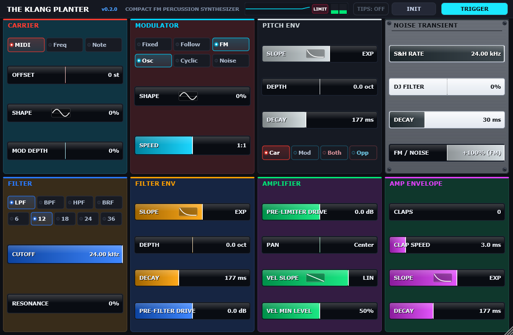
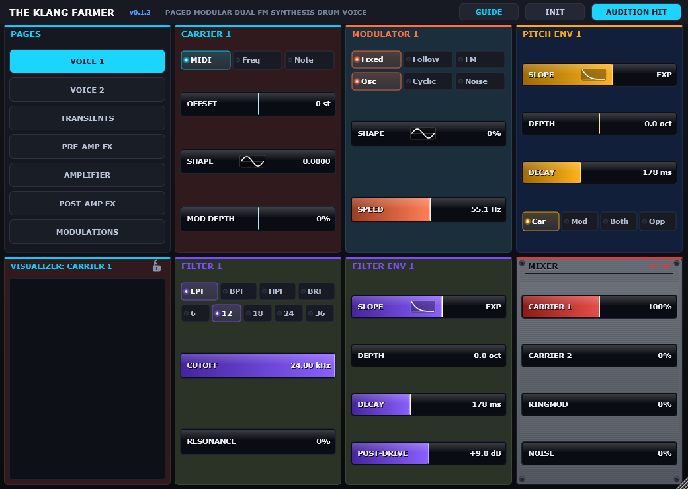
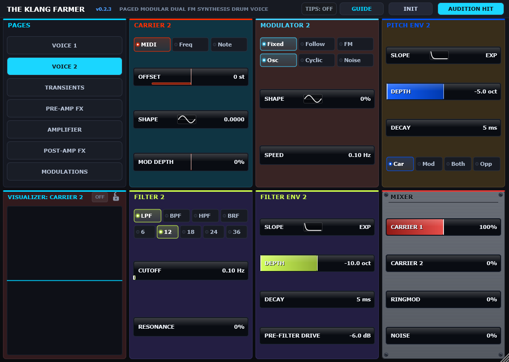
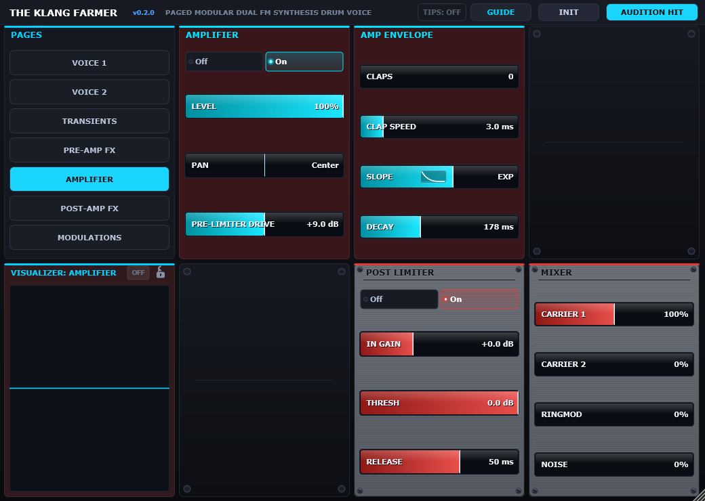
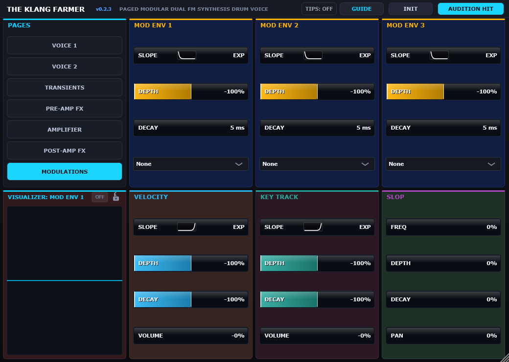
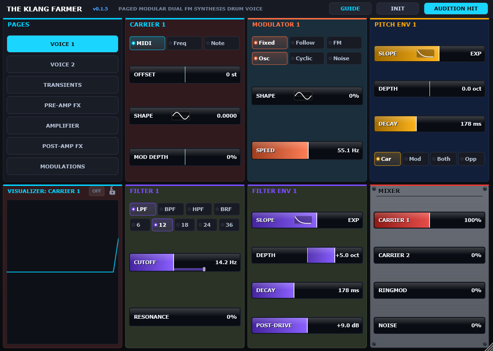
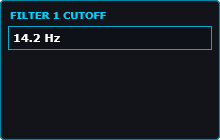

# The Klang Farmer & The Klang Planter

> **Modular Dual-FM & Compact Percussion Synthesis System**  
> Built in modern C++20 with JUCE 9.0.3. Available as **VST3 Plugins** and **Standalone Applications**.

[](https://github.com/codygratner/TheKlangSuite/releases)
[](https://en.cppreference.com/w/cpp/20)
[](https://juce.com/)
[](LICENSE)
[](#installation)

> [!NOTE]
> **AI / Pair-Programming Note**:  
> **The Klang Farmer and The Klang Planter were vibe-coded with Google Gemini using Antigravity.** From initial DSP architecture and modular voice routing to real-time oscilloscopes, Bode plots, zero-allocation real-time audio threads, and hardware-style UI ergonomics, the entire project was designed, implemented, and iteratively refined through autonomous pair-programming with Gemini in Antigravity.

> [!TIP]
> **Engineering Documentation & Architecture Wiki**:  
> For technical deep-dives into our real-time DSP safety rules, 4-layer declarative JSON schemas, headless GUI testing harness, and future milestone specifications, visit the **[Documentation Wiki](docs/README.md)**.

---

### The Klang Farmer (22-Module Paged Modular Drum Synthesizer)


---

### The Klang Planter (Compact 8-Module Single-Voice FM Drum Synthesizer)


---

## Overview

**The Klang Suite** is a unified audio percussion ecosystem built in modern C++20 with JUCE 9.0.3, comprising three synchronized tools:

1. **The Klang Farmer**: A flagship 22-module paged modular dual-FM percussion synthesizer with 8 assignable multi-instance FX slots, dual voice engines, ring modulation, 3 modulation envelopes, analog slop emulation, and deep Bode/oscilloscope visualizers in an ergonomic 2x4 rack chassis (1040 &times; 740 px).
2. **The Klang Planter**: A compact, laser-focused single-voice FM drum synthesizer in an immediate 2x4 rack layout. Features a dedicated FM synthesis pair, percussive pitch envelope, S&H noise transient, pre-filter crossfader, multimode filter with pre-filter drive, amplifier with velocity curve/floor controls, and a dedicated lookahead brickwall Limiter card with live visualizer reduction metering.
3. **The Klang Editor**: A standalone desktop parameter inspection and JSON layout tool for sound designers and developers, offering real-time card previewing, control validation, and snapshot management.

---

## Gallery

| Voice 1 (Standard Palette) | Voice 2 (Inverted Complementary Palette) |
| :---: | :---: |
|  |  |

| Amplifier & Master Limiter | Modulations Rack (Mod Envelopes + Dynamics) |
| :---: | :---: |
|  |  |

| Real-Time Modulation Visualization | Right-Click Callout Popup |
| :---: | :---: |
|  |  |

---

## Key Features

#### 1. Dual FM Voice Engine & Per-Voice Filtering
- **Two FM Operator Pairs**: Independent `Carrier 1 & Modulator 1` and `Carrier 2 & Modulator 2` engines with 5-point warp decay curves.
- **Carrier Pitch Tracking & FM Depth Modulation Bar**:
  - Select between `MIDI` (tracks incoming MIDI with $\pm 24$ st semitone offset, center-detented bipolar meter), `Freq` (fixed continuous frequency from $20\,\text{Hz}$ to $24\,\text{kHz}$, defaulting to $55\,\text{Hz}$), and `Note` (fixed musical note across notes 0–127 with padded readout e.g. `A1   [   55 Hz,  33]`).
  - Active `MOD DEPTH` displays the affected frequency modulation span directly on the Carrier pitch slider (with real-time needle hidden to prevent high-frequency visual jitter).
- **Pitch Envelope with Inverse Mode**: Dedicated percussive decay envelopes for each voice feature `Car`, `Mod`, `Both`, and `Opp` (Opposite / Inverse mode, driving carrier and modulator pitch in reciprocal directions).
- **S&H Noise Engine & Global DJ Filter Standardization**:
  - Modulator Noise engine features a bipolar DJ Filter on parameter 3 and S&H Clock Rate ("Speed", $0.1\,\text{Hz} - 24\,\text{kHz}$, default $24\,\text{kHz}$) on parameter 4, swept dynamically by the pitch envelope.
  - All DJ Filters throughout the synth default to `0%` (center `0.5`) with double-click reset to `0%`.
- **Distinct Voice Palettes**: Voice 2 features an inverted complementary color palette (180° rotated hues on accents and card background tints) for instant visual differentiation.
- **Per-Voice Multimode Filters**: Each voice features its own dedicated multimode filter (LPF, BPF, HPF, BRF with 6/12/18/24/36 dB slopes) with resonance calibrated right to the edge of self-oscillation.
- **Cross-Voice Ring Modulation**: Raw cross-multiplication (`Carrier 1 × Carrier 2`) routeable into the 4-channel mixer.

### 2. Multi-Instance FX Engine (8 Independent Slots)
- **4 Pre-Amp FX Slots** and **4 Post-Amp FX Slots**.
- **No Slot Restrictions**: Any of the 13 effect processors can be instantiated into any slot. You can cascade up to 8 instances of the exact same effect in series (e.g., 8 wavefolders) or mix and match freely.
- **13 Effect Processors (Alphabetical Catalog)**:
  1. **Bell EQ**: Peaking parametric boost/cut and DJ-style dual filter tilt with Bode magnitude visualizer.
  2. **Chorus**: Dual quadrature sine LFOs driving stereo fractional delays with soft-saturation feedback.
  3. **Comb Filter**: Resonant feedback delay line with bipolar wet/dry mix (-100%:0% to +100%:0%, default +50%:50%, double-click reset to dry).
  4. **Drive**: Soft-clipping saturation with DC bias, post-filter, and limiter (+6 dB default gain, 0 dB double-click reset).
  5. **Filter**: Standalone multi-mode filter (LPF, BPF, HPF, BRF) with selectable slopes (6 dB to 36 dB/oct) and Bode visualizer.
  6. **Flanger**: Sub-millisecond delay line (0.2 ms – 5 ms) with bipolar resonant feedback (-95% to +95%).
  7. **Frequency Shifter**: True quadrature single-sideband frequency shifting with bipolar wet/dry blend (+50%:50% default, double-click reset to dry).
  8. **Grit FX (Bitcrusher)**: Word-length reduction (1.0 to 16.0 bits), sample-rate reduction, and dual-shelf tone shaping.
  9. **Phase Smear**: Cascaded all-pass filter network with selectable **2nd Order** or **4th Order** topology for subtle acoustic strike zapping or extreme dispersion.
  10. **Phaser**: 6-stage cascaded allpass ladder with regenerative feedback.
  11. **RingMod**: Morphable oscillator ring modulation with rate, amount, and stereo phase width.
  12. **Tempo Delay**: Pre-allocated stereo delay synced to host musical divisions (1/32 to 1/2) with damping tone filter and ping-pong crossfeed.
  13. **Wave Folder**: High-gain harmonic folder with DC bias and post-filter.
  *(Or **None / Bypass** to bypass the slot and render a brushed-aluminum blank rack plate).*

### 3. Transients & Modulation Matrix
- **Noise Transient Generator**: Dedicated filtered white/pink noise burst with its own filter envelope (`Filter 3 + Filter Env 3`).
- **Multi-Clap Generator**: Multi-burst envelope generator simulating handclap flam bursts.
- **3 Freely Assignable Mod Envelopes (Top Row)**:
  - Dedicated percussive decay envelopes with bipolar depth (-100% to +100%) and flexible slope curvature (Exponential, Linear, Logarithmic).
  - Dropdown target selector with **dynamic loaded-FX naming** (e.g. `Post FX 1 [Ring Mod]: Param 1 [Waveform]` or `Post FX 1 [Empty]: Param 1 [Empty]`) across 108 continuous synthesis and effect parameters.
- **Dynamics & Analog Drift (Bottom Row)**:
  - **Velocity Dynamics**: Dynamic scaling of output volume, envelope decay, and modulation depth.
  - **Key Tracking**: Scales envelope depth, decay, and level relative to incoming MIDI note.
  - **Slop**: Stepped random analog drift per trigger across frequency, FM depth, decay, and stereo panning.
- **Real-Time Modulation Visualization**:
  - Modulated parameters display an animated lower indicator bar under the slider illustrating the live modulation span and instantaneous needle position.
  - Right-click callout popup allows adjusting base slider values while monitoring live modulation sweep.
- **Silver Brushed Eurorack Faceplates**:
  - Mixer module and Limiters (Pre-Limiter & Master Limiter) feature authentic brushed-aluminum faceplates, corner rack screws, white recessed troughs, and signal red accents with dynamic text inversion.

### 4. Real-Time Phase-Locked Visualizations (Slot 5) & Global Controls
- **Self-Locked Oscilloscopes**: Carriers and modulators phase-lock to their own fundamental frequencies, eliminating visual drift even during deep FM sweeps.
- **Bode Magnitude Plots**: Real-time logarithmic X-Y response curves for filters and bell EQs ($20\,\text{Hz} - 24\,\text{kHz}$) with grid reference markers.
- **Auto-Tracking & Lock Toggle**: The visualizer automatically follows whichever module card you click or hover over. A padlock toggle lets you freeze the display on a specific module while tweaking others.
- **Visualizer OFF Button**: An `OFF` toggle badge directly in the visualizer header strip (dim grey when active, glowing red when off) suspends all scope and Bode rendering, locking to a calm flat baseline and saving CPU.
- **Settings & About Modal**: Access system diagnostics, build metadata, and community links via the top-header Gear icon.
- **GitHub Release Version Checker**: Background release checker alerting users with an illuminated emerald header badge when a new update is released.
- **INIT 3-Option Confirmation Dialog**: Clicking `INIT` launches an interactive confirmation modal with three distinct choices: `Default` (factory preset), `Clean` (factory sound with all 8 FX slots stripped to empty racks), and `Cancel`.

### 5. Rock-Solid Audio Thread Stability & Rigorous Testing
- **Zero Real-Time Allocations**: Strictly **no dynamic heap memory allocations** (`malloc`/`new`) on the audio rendering thread.
- **DAW & Renoise Bounce Stability**: All burst arrays, delay lines, and FFT/scope buffers are pre-allocated, guaranteeing zero audio dropouts or offline bounce crashes across arbitrary host block sizes (64 to 2048+ samples).
- **Automated Test Harness**: Validated by `gui_tests` (82 GUI assertions covering dynamic reflection, mouse simulation, and page routing) and `dsp_tests` (32 tests verifying mathematical curve accuracy, filter slopes, and DSP stability).

---

## Installation

Download the latest pre-compiled binaries from the **[Releases Page](https://github.com/codygratner/TheKlangSuite/releases)**:

### macOS (.pkg Installer / .dmg)
1. **Automated Installer**: Download `TheKlangSuite-v0.3.0-macOS.pkg` and run the installer. The installer automatically deploys the VST3, AU, and Standalone bundles to `/Library/Audio/Plug-Ins/` and executes the post-install unquarantine script so your DAWs immediately recognize the plugins with zero Gatekeeper friction.
2. **Portable DMG**: Alternatively, download `TheKlangSuite-v0.3.0-macOS.dmg`, drag the plugins to the symlinked folders, and run `Fix_Mac_Permissions.command` if macOS displays an untrusted developer prompt. See the included [macOS Installation & Security Guide](scripts/mac/macOS_Install_Guide.html) for visual walkthroughs.

### Windows (VST3 & Standalone)
1. **Automated Deploy**: Download `TheKlangSuite-v0.3.0-Windows.zip`. Run `deploy_vst3.bat` as Administrator to instantly deploy `The Klang Farmer.vst3` and `The Klang Planter.vst3` directly to `C:\Program Files\Common Files\VST3\`.
2. **Manual Copy**: Extract `.vst3` bundles into:
   ```
   C:\Program Files\Common Files\VST3\
   ```
3. **Standalone Apps**: Run `The Klang Farmer.exe`, `The Klang Planter.exe`, or `The Klang Editor.exe` directly from the `Standalone/` folder.
4. Rescan plugins in your DAW (Ableton Live, FL Studio, Reaper, Cubase, Bitwig, Studio One, Logic, Renoise).

---

## Building from Source

### Prerequisites
- **CMake 3.22+**
- **Visual Studio 2022 or 2026** (Windows) / **Xcode 14+** (macOS) / **GCC/Clang** (Linux)
- **Git**

### Build Instructions
```bash
# 1. Clone the repository with submodules/JUCE
git clone https://github.com/codygratner/TheKlangSuite.git
cd TheKlangSuite

# 2. Configure CMake
cmake -B build

# 3. Build Release binaries in parallel
cmake --build build --config Release --parallel

# 4. Run automated test suites
./build/Release/dsp_tests.exe
./build/Release/gui_tests.exe
```

Compiled binaries will be generated at:
- **The Klang Farmer (VST3)**: `build/TheKlangFarmer_artefacts/Release/VST3/The Klang Farmer.vst3`
- **The Klang Farmer (Standalone)**: `build/TheKlangFarmer_artefacts/Release/Standalone/The Klang Farmer.exe`
- **The Klang Planter (VST3)**: `build/TheKlangPlanter_artefacts/Release/VST3/The Klang Planter.vst3`
- **The Klang Planter (Standalone)**: `build/TheKlangPlanter_artefacts/Release/Standalone/The Klang Planter.exe`
- **The Klang Editor (Standalone)**: `build/TheKlangEditor_artefacts/Release/The Klang Editor.exe`
- **Automated Test Runners**: `build/Release/dsp_tests.exe` and `build/Release/gui_tests.exe`

### Deploying VST3 Plugins Locally (Windows)
Run [`deploy_vst3.bat`](deploy_vst3.bat) as Administrator (or double-click to prompt for UAC elevation) to automatically copy both plugins to `C:\Program Files\Common Files\VST3\`.

### Running Verification Tests
```bash
.\build\Release\dsp_tests.exe
.\build\Release\gui_tests.exe
```

---

## Architecture & Layout

The 8-slot, 2x4 layout is organized as follows:

| Slot 1 (Top Left) | Slot 2 | Slot 3 | Slot 4 |
| :---: | :---: | :---: | :---: |
| **Navigation Module** *(Fixed)* | Active Page Card | Active Page Card | Active Page Card |
| **Slot 5 (Bottom Left)** | **Slot 6** | **Slot 7** | **Slot 8 (Bottom Right)** |
| **Visualizer Module** *(Fixed)* | Active Page Card | Active Page Card | Active Page Card |

### Navigation Pages
1. **Voice 1**: Carrier 1, Modulator 1, Pitch Env 1, Filter 1, Filter Env 1, Mixer
2. **Voice 2**: Carrier 2, Modulator 2, Pitch Env 2, Filter 2, Filter Env 2, Mixer (Swapped Palette)
3. **Transients**: Clap Burst, Noise Transient, Filter 3, Filter Env 3, Mixer
4. **Pre-Amp FX**: FX Picker + Pre FX 1..4 (Assignable to any of 13 processors) + Pre Limiter
5. **Amplifier**: Main Amplifier + Amp Envelope + Post Limiter + Mixer
6. **Post-Amp FX**: FX Picker + Post FX 1..4 (Assignable to any of 13 processors) + Master Limiter
7. **Modulations**: Mod Envelopes 1–3 (Top Row) + Velocity, Key Tracking, and Slop (Bottom Row)

---

---

## 🗺️ Project Roadmap

The Klang Farmer and The Klang Planter follow strict Semantic Versioning. Development is organized into distinct, thematic milestones:

| Milestone | Theme | Key Features & Focus | Status |
| :--- | :--- | :--- | :--- |
| **`v0.2.0`** | **Initial Release** | Flagship dual-FM drum synth, 13 effects, modular pages, and visualizers. | ✅ Complete |
| **`v0.3.0`** | **The Architecture Update** | Data-driven JSON architecture, The Klang Editor (TKE), automated GUI regression harness, zero-cost macOS `.pkg` installer, and automated GitHub version checker. | 🔄 Active Development |
| **`v0.4.0`** | **The Sound & Chaos Update** | 26-algorithm FX expansion, 5-column browser modal, dual transient sample players, d6 parameter randomization, gated staccato bass, Undo/Redo & A/B, Velocity/MIDI Learn, and Panic switch. | 📋 Planned |
| **`v0.5.0`** | **The Pro Workflow Update** | JSON preset browser & tagging, 64–128 curated factory sound pack, one-click `.tkfbank` sharing, WAV/SF2 multi-sample export dialog, 2x/4x oversampling, 4 TBD-16 macros, zero-server GitHub crash reporting, and Linux headless CI. | 📋 Planned |
| **`v0.6.0`** | **The Visual Polish & UI Mastery Update** | High-DPI UI scaling (100%–200%), tactile industrial hardware depth, 60 FPS tear-free visualizers, and curated theme palettes (Cyberpunk, Cykranosh, Dracula, Monokai, Nord). | 📋 Planned |
| **`v1.0.0`** | **General Availability (GA)** | Official Public FOSS (GPLv3) Release, multi-platform automated installers, illustrated user manual, and launch demo reel. | 🚀 Target |
| **`v1.1.0+`** | **The Hardware Universe** | Standalone hardware synthesizer ports: **dadamachines tbd-16** (ESP32-P4/RP2350), **The Klang Seed: Daisy Edition** (STM32H750), **The Klang Seed: Studio Edition** (Teensy 4.1 multi-out), and **Zynthian V5**. | 🎛️ Post-1.0 |

> 👉 **For the detailed engineering task breakdown, phase specifications, and architectural plans, see [`docs/BACKLOG.md`](docs/BACKLOG.md).**

## Changelog
For a detailed chronological record of updates and releases, see [CHANGELOG.md](CHANGELOG.md).

---

## License

This project is open-source software licensed under the [GNU General Public License v3.0 (GPLv3)](LICENSE).

Copyright &copy; 2026 Cody Gratner (R'lyeh Sound).
