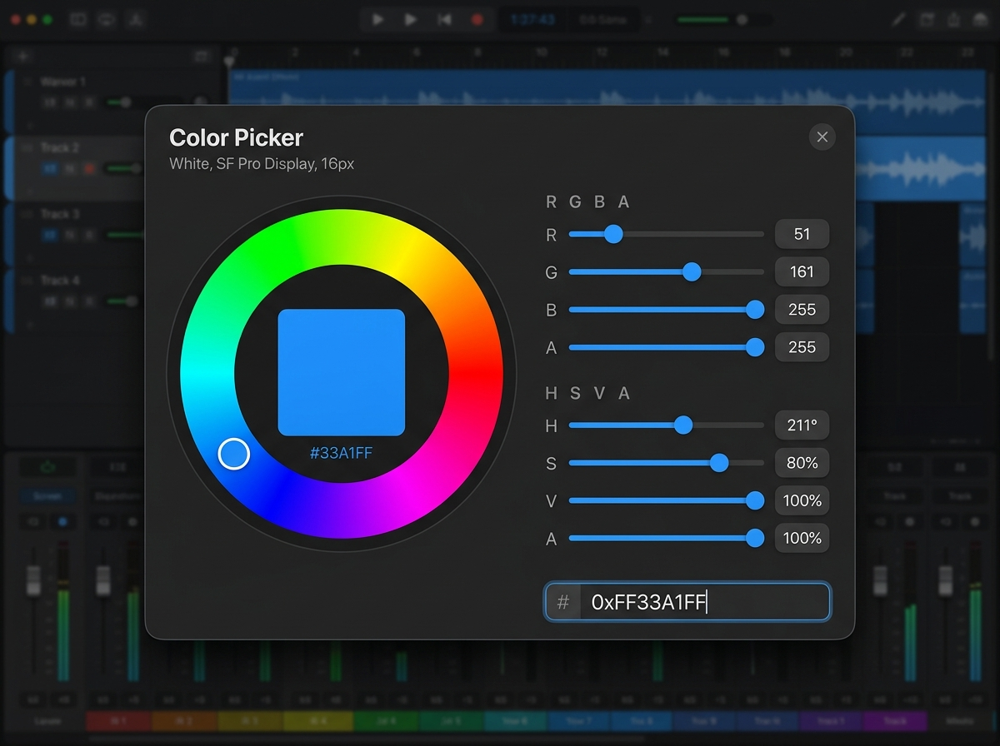

# Standalone JSON Data & Theme Editor

## Goal Description
Build a dedicated, standalone GUI application (`TheKlangEditor`) to rapidly author and preview the data-driven JSON architecture (`assets/controls/*.json` and `theme.json`). 

Instead of manually editing JSON text files and recompiling the synth to see visual changes, this tool will provide a 3-pane live-sync interface:
1. **Controls & Theme Form**: A property inspector with UI controls (color pickers, sliders, text boxes) for init values, double-click values, ranges, and layout assignments.
2. **Live Visual Preview**: A rendering canvas that instantiates the exact C++ UI components used by the synth, ensuring 1:1 visual parity.
3. **Raw JSON Editor**: A text editor pane with syntax highlighting for manual code adjustments.

Editing any of these three panes will instantly sync and reflect across the others.

## User Review Required
> [!IMPORTANT] 
> **App Framework Choice**
> By building this as a **JUCE Standalone GUI App** (added as a new target in `CMakeLists.txt`), we can `#include` the exact same `UIComponents.h` and `KlangCoreEditor.h` code from the main synth. This guarantees the preview pane looks *exactly* like the final VST3 plugin. Building it in a web framework (like React/Electron) would provide better text editing, but we would have to fake/re-create the JUCE UI in HTML/CSS, which defeats the purpose of an accurate preview.

## Proposed Changes

### 1. CMake Integration
Add a new executable target that links to the shared GUI code but explicitly excludes the heavy DSP (`PluginProcessor.cpp`). This will be wrapped in a CMake Option so it isn't compiled into public tagged releases by default, but remains available for those building from source.
#### [MODIFY] `CMakeLists.txt`
```cmake
option(BUILD_TK_EDITOR "Build The Klang Editor (Internal Dev Tool)" OFF)

if(BUILD_TK_EDITOR)
    # New target: TheKlangEditor (GUI App only)
    juce_add_gui_app(TheKlangEditor
        PRODUCT_NAME "The Klang Editor"
        VERSION ${PROJECT_VERSION}
    )
    target_sources(TheKlangEditor PRIVATE
        tools/editor/Main.cpp
        tools/editor/MainComponent.cpp
        # Shared sources
        source/UIComponents.cpp
        source/ParameterManager.cpp
    )
endif()
```

### 2. Standalone App Scaffolding
Create the standard JUCE GUI app entry point.
#### [NEW] `tools/editor/Main.cpp`
- Standard `juce::JUCEApplication` subclass.
- Creates a `juce::DocumentWindow` containing `MainComponent`.

### 3. The Unified Tabbed Interface
#### [NEW] `tools/editor/MainComponent.h` & `.cpp`
To prevent the C++ code from becoming a tangled, state-management nightmare (by trying to force a generic Property Panel to morph between an advanced Color Wheel and numeric DSP sliders), the layout uses a clean, two-tab architecture:

**Top-Level Navigation:** Two massive tabs: `[ THEME ]` and `[ CONTROLS ]`.

**Shared Components (Always visible regardless of the active tab):**
- **Right Pane (Visual Preview)**: A wrapper `juce::Component`. Always shows the live rendering of the UI. Whenever the JSON updates, this destroys and re-instantiates the specific `SynthCardComponent` (e.g., the Carrier Card) using the live layout/theme data.
- **Bottom Pane (Raw Code)**: `juce::CodeEditorComponent` attached to a `juce::CodeDocument`. Always shows the raw serialized JSON text of whatever file you're currently working on, allowing manual text adjustments with instant visual feedback.

#### Tab 1: THEME (Specialized Visuals)
When active, you are editing `theme.json`.
- **Left Sidebar**: A scrolling list/palette of all the colors defined in the theme.
- **Main View (Advanced Color Picker)**: Clicking a color from the list spawns a custom editor featuring:
  - An interactive click-and-drag **Color Wheel**.
  - Split out **RGBA** sliders/text boxes (Red, Green, Blue, Alpha).
  - Split out **HSVA** sliders/text boxes (Hue, Saturation, Value, Alpha).
  - A **Hex Code** input box formatted specifically for JUCE's required `0xAARRGGBB` format (Alpha must be included).
  
  
- **Preview State**: The Visual Preview pane switches to a "Style Guide" mode (or renders the full synth chassis) so you can instantly see global color changes applied everywhere.

#### Tab 2: CONTROLS (Specialized DSP Parameters)
When active, you are editing DSP parameter schemas.
- **Top Bar**:
  - `juce::ComboBox` for selecting the active module (e.g., `carrier.json`, `filters.json`).
  - Read-only, multi-line, word-wrapped text field clearly displaying the active file's absolute path.
- **Main View (Form Editor)**: `juce::PropertyPanel` that dynamically populates controls based on the active JSON keys. Uses `juce::TextPropertyComponent` and `juce::SliderPropertyComponent` for calibrating min/max numeric bounds and defaults.
- **Preview State**: The Visual Preview pane isolates and renders just the specific Card selected in the dropdown (using the global theme in the background).

### 4. Live Synchronization Engine
A central state manager to handle bidirectional updates without infinite loops.
- `juce::var activeJsonState;`
- **Form to JSON**: User picks a color -> `activeJsonState` is updated -> `CodeDocument` text is regenerated -> Preview is `repaint()`'d.
- **Text to Form**: User types in `CodeEditorComponent` -> triggers a delayed async parse (e.g., 500ms after typing stops) -> If JSON is valid, updates `activeJsonState` -> Updates Form values -> Preview is re-rendered.

---

### 5. Consolidated JSON Snapshot & Factory Restore (Un-Borkable Safety Net)
To ensure rapid experimentation without fear of corrupting configuration files:
- **Header Actions**:
  - `[ Export Snapshot ]`: Serializes all modular JSON files (`assets/controls/*.json`, `global_ui.json`, `theme.json`, and `assets/layouts/*.json`) into a single timestamped JSON bundle (e.g. `tke_snapshot_2026-10-06.json`).
  - `[ Import Snapshot ]`: Prompts to load an existing consolidated snapshot and unpacks it cleanly to the `assets/` subdirectories.
  - `[ Restore Factory Defaults ]`: Reverts all on-disk JSON assets back to the pristine baked-in reference state, instantly rescuing the user if a setting or layout is accidentally borked.
- **Reference Factory Snapshot**:
  - A clean pre-made export (`assets/factory_defaults_snapshot.json`) is committed to the repository, serving as the immutable recovery anchor.

---

## Verification Plan

### Automated Tests
1. **Compilation Check**: Run `/build-validate TheKlangEditor` to ensure the tool builds cleanly on macOS and Windows.

### Manual Verification
1. Launch `TheKlangEditor.exe`.
2. Select `carrier.json` from the dropdown.
3. Change the `"default"` init value of `carrier1_shape` in the text box pane.
4. Verify the visual slider in the Preview pane instantly snaps to the new default value.
5. Change a hex code in the `theme.json` Color Picker and verify the Preview background instantly changes.
6. Type a manual change in the Raw JSON pane and ensure the Form text boxes update automatically.
