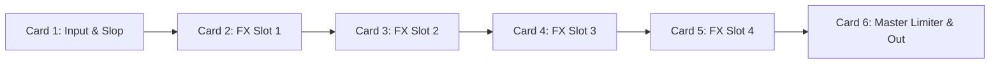

# Implementation Plan: The Klang Mill (Standalone VST)

## Goal Description
Create a standalone VST3/AU multi-effects plugin named **The Klang Mill (TKM)**. 

Rejecting open-ended modular routing complexity (Snap Heap / Phase Plant), The Klang Mill is an **Industrial 1x6 Multi-FX Pedalboard Rack** inspired by Soundtoys Effect Rack, Chase Bliss hardware, and vintage rackmount processors. It runs 4 serial studio-grade effects, global analog Slop drift, and a punishing master limiter for drum breaks, guitars, synths, and mix busses.

## User Review Required
> [!IMPORTANT] 
> **Core Architecture & DSP Reuse**
> Inherits directly from `KlangCoreProcessor` and `KlangCoreEditor`, giving it JSON preset management, theme styling, and the full 26-algorithm FX catalog from `source/ModularBlocks.h` with zero code duplication.

---

## The 1x6 Pedalboard Chassis Layout

### Chassis Details (1 Row, 6 Columns):
- **Card 1: Input & Global Slop**:
  - Knob 1: **Input Trim** ($-24\,	ext{dB}$ to $+24\,	ext{dB}$).
  - Knob 2: **Global Mix** ($0\%$ dry to $100\%$ wet).
  - Knob 3: **Slop Rate** (Per-cycle or audio-rate analog parameter drift).
  - Knob 4: **Slop Depth** (Macro chaos/drift injected across all active pedal stages).
  - Toggle: **Phase Invert** & **Mono/Stereo link**.
- **Cards 2–5: Multi-FX Pedal Slots 1–4**:
  - Click title to open the 5-column **Categorized FX Browser Modal** (26 algorithms).
  - `<` and `>` arrow steppers for instant sequential pedal switching.
  - 4 dynamic parameter knobs reflecting the loaded effect with custom tooltips and quick-snap callouts.
  - Dedicated **Bypass Stomp Switch** at the bottom of each card.
- **Card 6: Master Output & Limiter**:
  - Knob 1: **Threshold** (Limiter ceiling).
  - Knob 2: **Release** ($5\,	ext{ms} - 500\,	ext{ms}$).
  - Knob 3: **Drive / Fold** (Analog wavefolding saturation stage).
  - Knob 4: **Output Gain** ($-24\,	ext{dB}$ to $+24\,	ext{dB}$).
  - Toggle: **Limiter Enable / Hard Clip mode**.

---

## Verification Plan

### Automated Tests
1. `cmake --build build --target TheKlangMill_VST3` compiles cleanly with zero allocations in `processBlock`.
2. Audio-thread verification: serial FX chaining processes cleanly without mutexes or thread stalls.

### Manual Verification
1. Load `The Klang Mill.vst3` on an audio track in a DAW.
2. Verify it renders as a clean, compact 1x6 horizontal rack.
3. Test stompbox bypass buttons on individual slots.
4. Verify Slop knob injects organic pitch/filter drift across the pedals.
