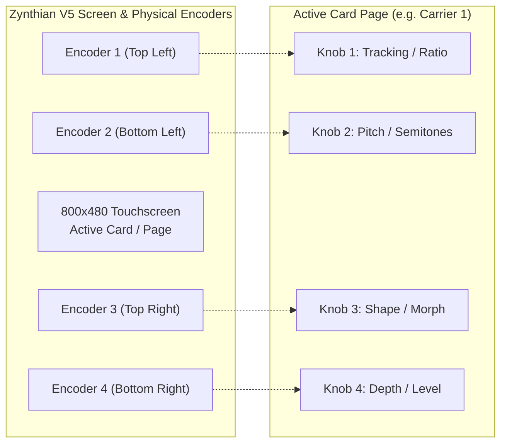

# Architecture & Implementation Plan: Zynthian V5 / V4 Hardware Port (Tentative)

## 1. Goal Description
Provide a tentative hardware deployment pathway for running **The Klang Farmer** and **The Klang Planter** directly on **Zynthian** hardware (specifically the flagship **Zynthian V5**, with backward compatibility for V4/V3).

Zynthian is an open-source Linux-based standalone groovebox/synthesizer hardware ecosystem featuring:
- **Compute (V5)**: Raspberry Pi 5 (Quad-core ARM Cortex-A76 @ 2.4 GHz, 4GB/8GB RAM) running ZynthianOS (64-bit Debian-based Linux).
- **Interface**: 5-inch 800×480 capacitive multi-touch display.
- **Physical Controls**: 4 high-resolution push-rotary optical encoders surrounding the display.
- **Audio/MIDI**: High-end I2S stereo DAC/ADC + standard DIN-5 MIDI + USB MIDI host.

---

## 2. Integration Architecture: Headless LV2 / CLAP

Because Zynthian already has its own highly refined touch/encoder UI framework (MOD-UI, Jalv, and Zynthian-UI), compiling a heavy desktop GUI plugin (JUCE OpenGL/software renderer) creates unnecessary GPU/CPU overhead.

Instead, we target a **Headless Linux LV2 / CLAP plugin**:
- **Zero GUI Overhead**: Compiles purely the audio processor and APVTS state tree with `#define JUCE_STANDALONE_APPLICATION 0` and headless flags.
- **Native Zynthian Host**: Zynthian automatically parses the LV2 TTL RDF manifest or CLAP parameter descriptions and constructs its native multi-page display.
- **Native Presets & MIDI Learn**: ZynthianOS handles MIDI CC mapping, snapshots, and audio routing without any custom C++ code needed on our end.

---

## 3. The 4-Knob Page Mapping Schema

Because our entire synthesizer architecture is mathematically standardized into **4-knob cards** (Carrier 1, Modulator 1, Pitch Env 1, Filter, etc.) and **4-knob FX slots**, mapping onto Zynthian's **4 physical encoders** is completely seamless (1:1 direct correspondence):



### Zynthian Page List:
1. **Page 01**: Carrier 1 (Ratio, Pitch, Shape, Depth)
2. **Page 02**: Modulator 1 (Track, Wave, Shape, Rate)
3. **Page 03**: Pitch Env 1 (Target, Slope, Depth, Decay)
4. **Page 04**: Amp Env 1 (Slope, Hold, Decay, Curve)
5. **Page 05**: Carrier 2 / Body (Ratio, Pitch, Shape, Depth)
6. **Page 06**: Modulator 2 (Track, Wave, Shape, Rate)
7. **Page 07**: Filter (Cutoff, Res, Drive, Mode)
8. **Page 08–15**: Pre-FX Slots 1–4 & Post-FX Slots 1–4 (4 parameters per page)
9. **Page 16**: Master & Limiter (Level, Pan, Threshold, Release)

---

## 4. Cross-Compilation & Build Pipeline

To build for Zynthian ARM64 on a Windows/macOS development machine:
1. **CMake Target**: Add a headless LV2/CLAP build flag in `CMakeLists.txt`:
   ```cmake
   if (BUILD_HEADLESS_LINUX)
       juce_add_plugin(TheKlangFarmer_Headless
           FORMATS LV2 CLAP
           IS_SYNTH TRUE
           NEEDS_MIDI_INPUT TRUE
           NEEDS_MIDI_OUTPUT FALSE
           EDITOR_WANTS_KEYBOARD_FOCUS FALSE
       )
       target_compile_definitions(TheKlangFarmer_Headless PRIVATE JUCE_HEADLESS=1)
   endif()
   ```
2. **Docker Cross-Compilation Container**:
   - Utilize a multi-arch Debian Bookworm container with `gcc-aarch64-linux-gnu` to produce native ARM64 `.lv2` / `.clap` bundles.
3. **Deployment**:
   - Copy the generated `.lv2` directory to `/zynthian/zynthian-my-data/presets/lv2/` via SSH/SFTP or Zynthian WebConf.

---

## 5. Status: TENTATIVE
This item remains on the roadmap as a tentative hardware exploration for Milestone `v0.6.0`.
