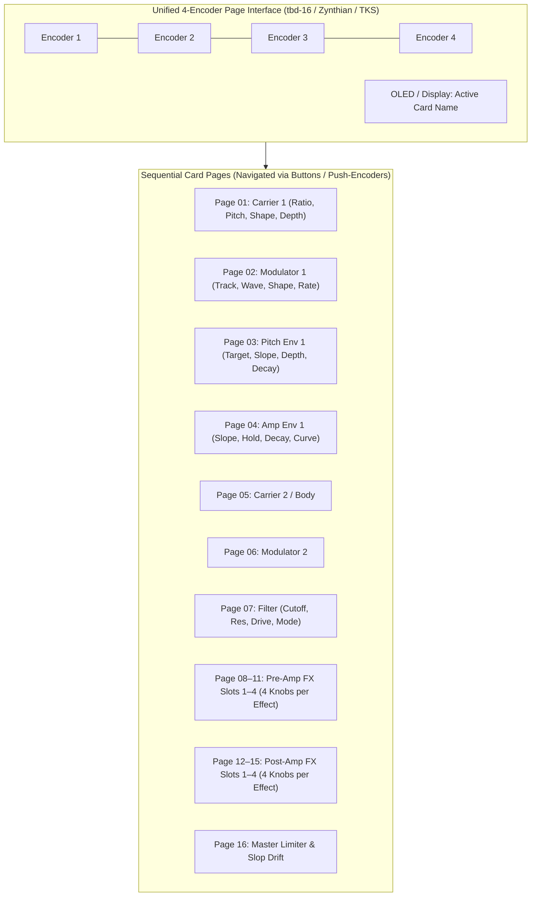

# Architecture & Implementation Plan: dadamachines tbd-16 & The Klang Seed Hardware Integration

## 1. Goal Description
Specify the hardware integration and deployment pathways for running the pure C++ synthesizer and 26-algorithm Effects engine across dedicated embedded hardware targets:
1. **dadamachines tbd-16**: Hackable groovebox / standalone synthesizer platform.
2. **The Klang Seed (TKS)**: DIY hardware drum machine based on **Daisy Seed** (stereo) or **Teensy 4.1** (8 discrete voice outputs).
3. **Zynthian V5**: Raspberry Pi 5 Linux standalone synth box.

---

## 2. Hardware Architecture Fact-Check & Verification

### Target 1: dadamachines tbd-16
Verified open-source hardware architecture:
- **Audio DSP Core**: **Espressif ESP32-P4** (Dual-core RISC-V @ 400 MHz) running real-time audio DSP and synthesis.
- **UI & Controller Core**: **Raspberry Pi RP2350B** (Dual-core ARM Cortex-M33 / Hazard3 RISC-V @ 150 MHz) handling 30 tactile RGB buttons, step sequencer, and 2.4" OLED display.
- **Wireless Core**: **ESP32-C6** handling Wi-Fi, BLE, and Ableton Link sync.
- **Physical Controls**: **4 endless push-encoders** + volume potentiometer + 30 RGB step/function buttons.
- **1:1 Mapping Miracle**: The '16' in tbd-16 refers to its **16 sequencer tracks**, NOT 16 knobs! Because the physical unit has **4 endless encoders**, our **4-knob card architecture** (`Carrier 1`, `Filter`, `Pre-FX 1`, etc.) maps **1:1 natively per page** on its 2.4" OLED screen!

### Target 2: The Klang Seed (TKS) — Daisy Seed vs Teensy 4.1
These are two distinct, non-overlapping ARM Cortex-M7 platforms:
- **Daisy Seed (Electro-Smith)**:
  - **SoC**: STMicroelectronics **STM32H750IB** ARM Cortex-M7 @ 480 MHz.
  - **Memory**: **64 MB high-speed SDRAM** built-in (massive buffer capacity for delays, reverbs, and sample playback).
  - **Audio Codec**: Integrated AK4556 24-bit 96 kHz stereo DAC/ADC.
  - **Best For**: Compact, plug-and-play stereo desktop drum synth or Eurorack module.
- **Teensy 4.1 (PJRC)**:
  - **SoC**: NXP **i.MX RT1062** ARM Cortex-M7 @ 600 MHz.
  - **Memory**: 1 MB on-chip TCM RAM (expandable with 8 MB external PSRAM chips).
  - **Audio Engine**: TDM (Time Division Multiplexing) driving an external CS42448 8-channel DAC.
  - **Best For**: Studio drum machine with **8 discrete physical 1/4" analog voice outputs**.

### Target 3: Zynthian V5
- **Compute**: Raspberry Pi 5 (Quad-core ARM Cortex-A76 @ 2.4 GHz) running 64-bit ZynthianOS (Debian Linux).
- **Physical Controls**: 5-inch 800x480 capacitive touchscreen + **4 optical push-rotary encoders**.
- **Format**: Headless Linux LV2 / CLAP plugin.

---

## 3. The 4-Encoder Paging Standard Across All 3 Targets

Because **all three hardware platforms (tbd-16, Zynthian V5, and TKS)** share the exact same physical control interface—**4 rotary encoders and an OLED/LCD display**—our parameter mapping is 100% unified:

---

## 4. Proposed C++ Repository Layout

### Component: `embedded/`
- `embedded/common/`: Pure C++ headless parameter bridge and page navigation state machine.
- `embedded/targets/tbd16/`: CTAG TBD C++ engine plugin for ESP32-P4 + RP2350B.
- `embedded/targets/daisy_seed/`: `libDaisy` stereo firmware for STM32H750.
- `embedded/targets/teensy41/`: 8-voice multi-out firmware with CS42448 TDM audio driver.
- `embedded/targets/zynthian/`: Headless Linux LV2 / CLAP build manifest and TTL generator.

---

## 5. Verification Plan

### Automated Tests
1. Headless simulation test verifying that cycling through all 16 pages and updating the 4 encoders accurately maps to APVTS / engine parameters without zipper noise.
2. Cycle count profiling: verify mono drum voice takes $< 250$ cycles per sample on Cortex-M7 and ESP32-P4.
