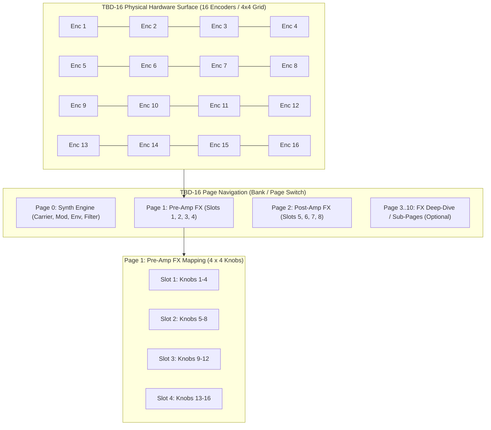

# Architecture & Implementation Plan: TBD-16 Effects & The Klang Seed Integration

## Goal Description
Answer the hardware architecture questions and design the integration of the modular 26-algorithm Effects engine into the **TBD-16** control surface (16-knob / 4×4 grid controller) and **The Klang Seed (TKS)** standalone embedded hardware package. 

Specifically, this plan addresses:
1. **Does the TBD-16 have effects?** Yes. In `spec.md`, every single effect was mathematically standardized with exactly **4 controls** specifically so that 4 distinct effects map cleanly across the 16 physical knobs ($4 \times 4 = 16$).
2. **Can effects be multiple pages?** Yes. A 16-encoder hardware surface naturally supports bank/page switching. With 4 Pre-Amp FX slots and 4 Post-Amp FX slots, the entire 8-slot rack maps perfectly to a two-page system:
   - **Page 1: Pre-Amp FX Rack** (Slots 1, 2, 3, 4 $\times$ 4 knobs = 16 knobs)
   - **Page 2: Post-Amp FX Rack** (Slots 5, 6, 7, 8 $\times$ 4 knobs = 16 knobs)
3. **Can we make these available in the TBD-16 as part of The Klang Seed package?** Yes. Because our DSP engine in [`source/ModularBlocks.h`](file:///c:/Dev/TheKlangFarmer/source/ModularBlocks.h) and [`source/DSPBlock.h`](file:///c:/Dev/TheKlangFarmer/source/DSPBlock.h) is already 100% decoupled from JUCE, all 26 DSP algorithms compile directly onto embedded targets (Teensy 4.1 NXP ARM Cortex-M7 @ 600 MHz or Daisy Seed STM32H750 @ 480 MHz).

---

## User Review Required

> [!IMPORTANT]
> **Embedded Memory Constraints:**
> While algorithmic effects (Distortion, Filters, EQ, Wavefolder, RingMod, Transient Shaper) require virtually zero RAM ($< 1\,\text{KB}$), time-based delay and reverb effects (Tempo Delay, Gated Reverb, Haas Delay, Juno Chorus) require ring buffers. 
> - On **Teensy 4.1**, delay buffers live in external 8 MB PSRAM or the 512 KB TCM DTCM/ITCM RAM.
> - On **Daisy Seed**, delay buffers live in the onboard 64 MB SDRAM.
> Pre-allocating maximum buffer lengths for 8 simultaneous multi-instance FX slots requires approximately $2.5\,\text{MB}$ of total buffer space at $44.1\,\text{kHz}$, which easily fits into both target hardware platforms.

---

## Hardware Control Layout & Pagination Schema



### 1. Macro Page Mode (Overview)
- **Pre-Amp FX Page**:
  - Row 1 (Knobs 1–4): **FX Slot 1** (Param 1, Param 2, Param 3, Mix)
  - Row 2 (Knobs 5–8): **FX Slot 2** (Param 1, Param 2, Param 3, Mix)
  - Row 3 (Knobs 9–12): **FX Slot 3** (Param 1, Param 2, Param 3, Mix)
  - Row 4 (Knobs 13–16): **FX Slot 4** (Param 1, Param 2, Param 3, Mix)
- **Post-Amp FX Page**:
  - Row 1 (Knobs 1–4): **FX Slot 5** (Param 1, Param 2, Param 3, Mix)
  - Row 2 (Knobs 5–8): **FX Slot 6** (Param 1, Param 2, Param 3, Mix)
  - Row 3 (Knobs 9–12): **FX Slot 7** (Param 1, Param 2, Param 3, Mix)
  - Row 4 (Knobs 13–16): **FX Slot 8** (Param 1, Param 2, Param 3, Mix)

### 2. Slot Selection & Type Switching
- Pushing encoder down (encoder push-switch) or holding a dedicated Shift button enters the **Algorithm Selector**:
  - Turning the encoder scrolls through the 26 algorithms.
  - Small OLED / 7-segment screen displays the active algorithm name (e.g. `"WAVGUID"`, `"JUNOCHR"`).

---

## Embedded Architecture: The Klang Seed (TKS)

### 1. Zero-Allocation Modular DSP Engine
The existing desktop engine structure will be mapped into an embedded HAL:
- **No `std::vector` dynamic resizing**: Delay buffers and reflection taps are statically allocated at compile time in PSRAM / SDRAM using fixed arrays:
  ```cpp
  // Statically allocated in Teensy 4.1 EXTMEM (8MB PSRAM) or Daisy SDRAM
  EXTMEM float fxDelayPool[MAX_FX_SLOTS][MAX_DELAY_SAMPLES];
  ```
- **Real-Time Interrupt Processing**:
  - Supports single-sample audio processing for I2S/SAI DMA ring buffers (`processSample(float& left, float& right)`).
  - Native 32-bit float hardware acceleration using Cortex-M7 FPU (`VFPv5-D16`).

---

## Proposed Changes to the Repository

### Component: Embedded Hardware Core (`embedded/`)

#### [NEW] `embedded/tks_core/TKS_EffectsEngine.h`
- Embedded wrapper for the 26 DSP blocks from [`source/ModularBlocks.h`](file:///c:/Dev/TheKlangFarmer/source/ModularBlocks.h).
- Strips any remaining standard library CRT calls in favor of [`source/FastMath.h`](file:///c:/Dev/TheKlangFarmer/source/FastMath.h).
- Manages static buffer pooling across the 8 multi-FX slots.

#### [NEW] `embedded/tks_core/TBD16_PageManager.h`
- 16-encoder banking and pagination state machine:
  - Manages active page index (`PAGE_VOICE`, `PAGE_PRE_FX`, `PAGE_POST_FX`).
  - Handles encoder resolution, acceleration, and parameter pickup / soft-takeover.
  - Generates display text strings for hardware OLED displays (128x32 or 128x64 I2C/SPI).

---

## Verification Plan

### Automated Simulation Tests (Desktop)
1. **Desktop TBD-16 Simulator (`test/tbd16_tests.cpp`)**:
   - Create a headless test that feeds mock 16-encoder MIDI CC / rotary events to `TBD16_PageManager`.
   - Verify that switching between Page 1 (Pre-FX) and Page 2 (Post-FX) correctly updates the underlying DSP parameters across all 8 slots without clicks or zipper noise.
2. **Buffer Bounds Test**:
   - Verify zero allocations occur during active algorithm switching and audio rendering.

### Hardware Verification
1. Flash reference firmware onto **Teensy 4.1** or **Daisy Seed**.
2. Profile audio cycle budget on a 600 MHz Cortex-M7 with all 8 FX slots active simultaneously.
   - Target: Total FX rack budget $< 25\%$ CPU load.
