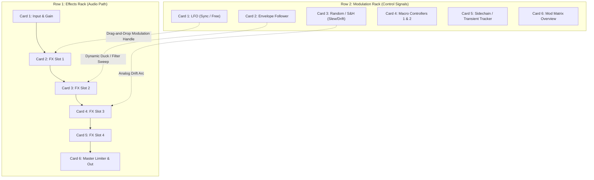

# Implementation Plan: The Klang Mill (Standalone Multi-FX VST)

## Goal Description
Create a standalone VST3/AU multi-effects plugin in the ecosystem named **The Klang Mill (TKM)**. Stripping away drum voice synthesis, it acts as a modular serial multi-effects rack and modulation sandbox for external audio tracks (guitars, vocals, drums, master bus).

Inspired by Kilohearts Snap Heap, it features a **2-Row Chassis**:
- **Row 1: 4-Slot Effects Rack + Limiter & I/O**
- **Row 2: Dedicated Modular Modulation Rack** (LFO, Envelope Follower, Random/S&H, Macros) with **Drag-and-Drop Modulation Routing**.

## User Review Required
> [!IMPORTANT] 
> **Base Class & DSP Reuse**
> The Klang Mill inherits directly from `KlangCoreProcessor` and `KlangCoreEditor`, gaining JSON preset management, theme styling, and the full 26-algorithm FX catalog from `source/ModularBlocks.h`.

---

## Proposed Architecture: 2x6 Modular Chassis

### 1. Row 1: Effects Rack Layout
- **Card 1: Input Stage**: Input Trim gain, Phase Invert, Mono/Stereo link, Global Dry/Wet blend.
- **Cards 2–5: Multi-FX Slots 1–4**:
  - Clicking title opens the 5-column **Categorized FX Browser Modal** (26 algorithms).
  - 4 dynamic parameter knobs reflecting the loaded effect.
  - Active colored modulation arcs drawn around each knob when modulated.
- **Card 6: Master Limiter & Output**: Master Ceiling, Release, Saturation Fold/Bias, and Output Volume.

### 2. Row 2: Modulation Rack Layout
- **Card 1: Multi-Wave LFO**:
  - Knob 1: **Rate** (BPM sync divisions `1/32` to `8 Bars` or Free `0.01 Hz` – `50 Hz`).
  - Knob 2: **Shape / Waveform** (Continuous morph: Sine -> Tri -> Saw -> Square -> Random).
  - Knob 3: **Phase / Offset** ($0^\circ$ to $360^\circ$).
  - Knob 4: **Depth** (Master bipolar scale).
- **Card 2: Audio Envelope Follower**:
  - Dynamically extracts amplitude envelope from incoming audio.
  - Knob 1: **Attack** ($0.1\,	ext{ms} - 100\,	ext{ms}$).
  - Knob 2: **Release** ($10\,	ext{ms} - 2000\,	ext{ms}$).
  - Knob 3: **Sensitivity / Gain** (Input threshold multiplier).
  - Knob 4: **Mode / Slew** (Linear vs Logarithmic response).
- **Card 3: Random / Sample & Hold**:
  - Generates organic analog drift, stepped sample-and-hold, or smooth Perlin noise.
  - Knob 1: **Rate / Frequency**.
  - Knob 2: **Smoothing / Slew** (Stepped staircase $\leftrightarrow$ continuous wander).
  - Knob 3: **Jitter / Chaos** (Irregularity factor).
  - Knob 4: **Depth**.
- **Card 4: Macro Knobs 1 & 2**:
  - Dual global performance macros to control multiple targets simultaneously.
- **Card 5: Transient / Audio Gate**:
  - Detects percussive transients to fire one-shot modulation bursts.
- **Card 6: Modulation Manager**:
  - Clear all assignments button, mute modulations toggle.

### 3. Drag-and-Drop Modulation Routing Engine
- **Visual Handles**: Every modulator card displays a crosshair/drag handle icon.
- **Drag Target Highlighting**: Clicking and dragging the handle highlights all valid knobs in Row 1.
- **Modulation Rings**: Dropping onto a knob attaches a modulation connection with an adjustable bipolar range arc rendered in the modulator's accent color (e.g. Yellow for LFO, Cyan for Env Follower, Magenta for Random).

---

## Verification Plan

### Automated Tests
1. `cmake --build build --target TheKlangMill_VST3` compiles cleanly with zero allocations in `processBlock`.
2. Audio-thread verification: modulation calculations run in block chunks without heap allocation or mutex locking.

### Manual Verification
1. Load `The Klang Mill` into a DAW on an audio track.
2. Drag LFO handle onto FX 1 Cutoff knob; verify colored modulation arc appears and modulates in real-time.
3. Feed audio; verify Envelope Follower responds dynamically to input volume.
